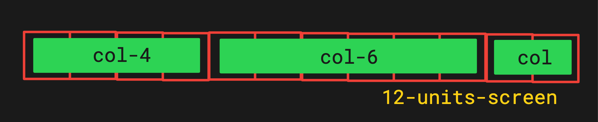
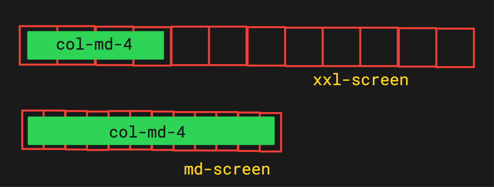
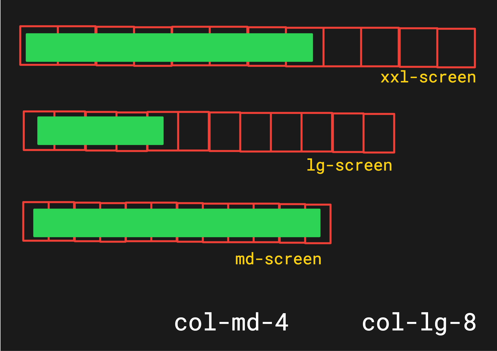
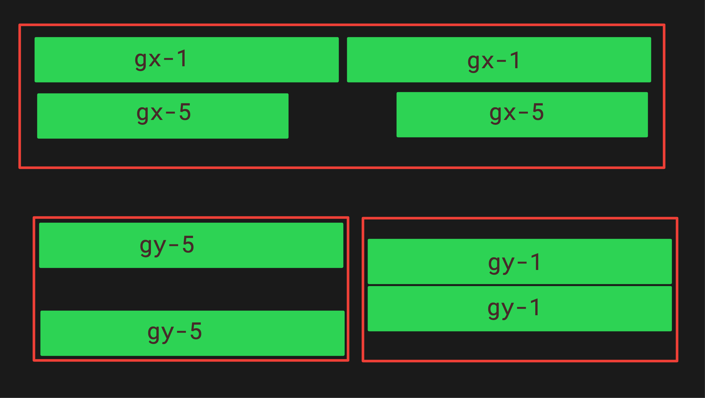

# [amazon.com](https://www.amazon.com/) clone using BOOTSTRAP

## Bootstrap basics notes
* bootstrap has `classes` like `row` and `col` by default. [here's list](https://www.w3schools.com/bootstrap/bootstrap_ref_all_classes.asp)

### installation
- [installation](https://getbootstrap.com/docs/5.3/getting-started/introduction/)

### Column Layout

- screen is divided into 12 units of column
- 6 screen-size breakpoints are defined.
  
  | class | column width | screen size |
  | --- | --- | --- |
  | col-xxl-1 | 1 | xxl |
  | col-xl-2 | 2 | xl |
  | col-lg-3 | 3 | lg |
  | col-md-4 | 4 | md |
  | col-sm-6 | 5 | sm |
  | col-xs-12 | 6 | xs |

### container Layout (column)

  * container class, decides elements behavior.
  * Example: `container-md` full-width: for-small-screen 

  | null | Extra small <576px | Small ≥576px | Medium ≥768px | Large ≥992px | X-Large ≥1200px | XX-Large ≥1400px |
  | --- | --- | --- | --- | --- | --- | --- |
  | `.container`            | 100%          | -          | -         | -            | -            | - |
  | `.container-sm`         | 100%          | -          | -         | -            | -            | - |
  | `.container-md`         | 100%          | 100%           | -         | -            | -            | - |
  | `.container-lg`         | 100%          | 100%           | 100%          | -            | -            | - |
  | `.container-xl`         | 100%          | 100%           | 100%          | 100%             | -            | - |
  | `.container-xxl`        | 100%          | 100%           | 100%          | 100%             | 100%              | - |
  | `.container-fluid`      | 100%          | 100%           | 100%          | 100%             | 100%              | 100% |

### Grid (row) layout
  
  * `col-4` class consumes 4 units of 12.
  * `col-6` class consumes 6 units of 12.
  * `col` class consumes remaining units of 12.
  
  * `col-md-4`
    * class consumes 4 units of 12.
    * consumed `full-width` inside `md-screen-size` .
  * `col-md-4` + `col-lg-8`
  
    * class consumes 8 units between lg & xxl screen.
    * consumes 4 units between md & lg
    * but consumed `full-width` inside `md-screen-size` .
  * #### align Vertically
    * ##### vertically align
      
      * `align-items-start` at top vertically.
      * `align-items-center` at center vertically.
      * `align-items-end` at the bottom.
    * ##### horizontally align
      
      * `justify-content-start` at start horizontally.
      * `justify-content-center` at center horizontally.
      * `justify-content-end` at end horizontally.
  * ### Margins & padding
    | notation | meaning |
    | --- | --- |
    |`m`| margin |
    |`p`| padding |

    | sub-notation | meaning |
    | --- | --- |
    |`t`| top |
    |`b`| bottom |
    |`l`| left |
    |`r`| right |
    |`x`| x (left & right) |
    |`y`| y (top & bottom) |
    |blank| all sides |

    example: `my-5`: margin-top-bottom-5
    
  * ### gutters
    
    * #### gutter-x
    * #### gutter-y
   
  * ### [buttons](https://getbootstrap.com/docs/5.3/components/buttons/)
    *  
